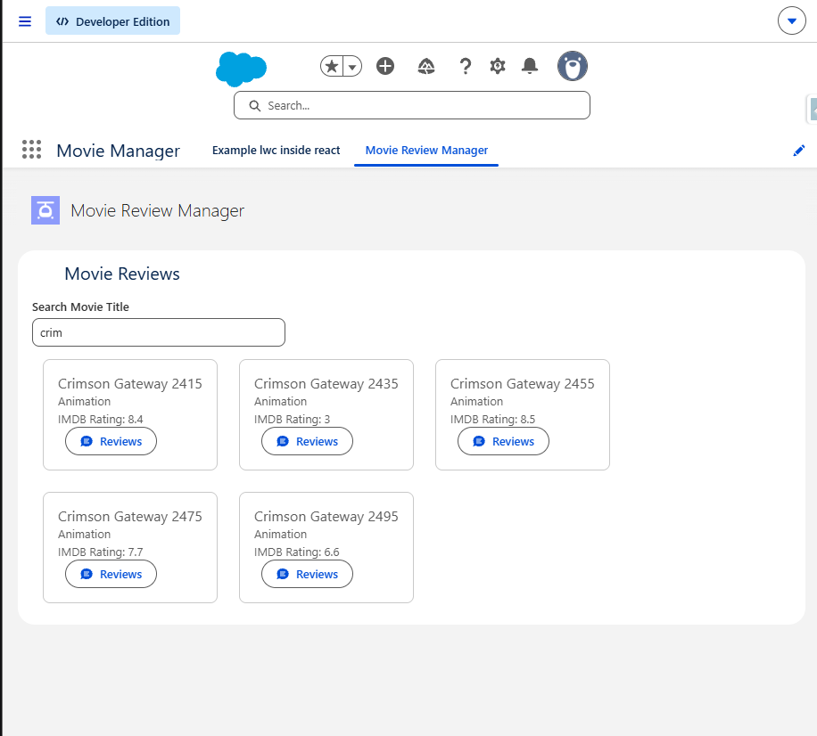
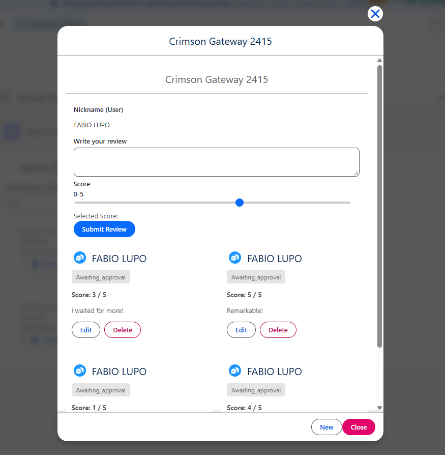
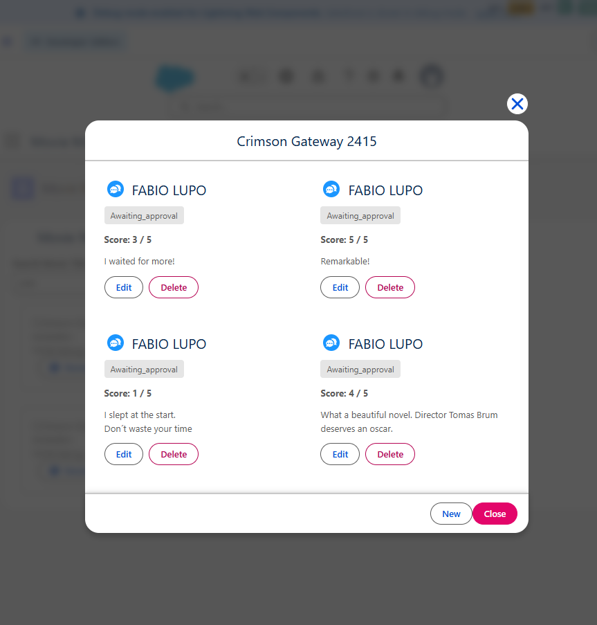

# Movie Management

A Salesforce DX sample app for browsing movies, submitting reviews, and demonstrating Lightning Web Component patterns with Apex-backed data access.

## Short summary

This project combines:

- A movie search experience in LWC
- Apex classes for data access and review submission
- A review workflow that includes modal-based user interactions
- A small React example embedded inside an LWC for demonstration purposes

## Examples

### GraphQL movie search

[`movieCrud`](force-app/main/default/lwc/movieCrud/) uses the Salesforce GraphQL wire adapter to search movies, paginate results, and display movie fields. See the [GraphQL query and component logic](force-app/main/default/lwc/movieCrud/movieCrud.js).

### Upload and display movie images

In [`movieCrud.html`](force-app/main/default/lwc/movieCrud/movieCrud.html), `lightning-file-upload` attaches JPG and PNG files while editing an existing movie. The component refreshes the file list and displays thumbnails returned by [`MovieFilesController`](force-app/main/default/classes/MovieFilesController.cls). The [sample SOQL query](scripts/soql/movieFiles.soql) inspects files linked to a record; replace its `LinkedEntityId` value with the ID from your org.

### React embedded in LWC

[`movieBrowser`](force-app/main/default/lwc/movieBrowser/) loads the bundled React app from a Salesforce static resource, fetches movie data through Apex, and mounts, updates, and unmounts the React view. The [React source](react-app/src/main.jsx) exports that lifecycle API; its [package configuration](react-app/package.json) builds the bundle into the static resource.

### Lightning Modal review workflow

The review modal in [`modalUserReviewList`](force-app/main/default/lwc/modalUserReviewList/) demonstrates loading reviews, editing and deleting them, validating review input, and showing success or error notifications with `ShowToastEvent`. See the [component logic](force-app/main/default/lwc/modalUserReviewList/modalUserReviewList.js) and [template](force-app/main/default/lwc/modalUserReviewList/modalUserReviewList.html).

## Screenshots

| Movie search                                                 | New review and existing reviews                                                              | Review list                                                                |
| ------------------------------------------------------------ | -------------------------------------------------------------------------------------------- | -------------------------------------------------------------------------- |
|  |  |  |

## Main components

- `movieReviewUser` — search for movies and launch the review flow
- `modalUserReview` — submit a new review
- `modalUserReviewList` — review list with edit and delete actions
- `movieCrud` — GraphQL movie search, CRUD, and movie image attachments
- `movieBrowser` — embedded React example inside an LWC
- Apex classes — data access and server-side validation

## Project structure

- `force-app/main/default/classes/` — Apex logic
- `force-app/main/default/lwc/` — Lightning components
- `react-app/` — React source example
- `scripts/apex/` — helper Apex scripts
- `config/` — scratch org metadata
- `manifest/` — deployment manifest

## Build and test

```bash
cd react-app
npm install
npm run build
```

From the repo root:

```bash
npm install
npm test
npm run lint
```

## Notes

This repository is intended as a lightweight Salesforce example app for LWC patterns, Apex service logic, and an embedded React/Lightning integration workflow.
